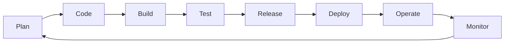

# DevOps and CI/CD with GitHub, Jenkins, and GitHub Actions

DevOps is a set of practices that combines software development (Dev) and IT operations (Ops) to shorten the development lifecycle and deliver high-quality software continuously. CI/CD (Continuous Integration/Continuous Deployment) is a core part of DevOps, enabling automated building, testing, and deployment of code.

---

## DevOps Lifecycle Flow Diagram

---

### Key Tools
- **Source Control Management (SCM):** [GitHub](https://github.com/) is widely used for version control, collaboration, and code review. Learn more in the [GitHub Docs](https://docs.github.com/en).
- **Jenkins:** An open-source automation server for building CI/CD pipelines. Jenkins can automate building, testing, and deploying code. See the [Jenkins Documentation](https://www.jenkins.io/doc/).
- **GitHub Actions:** A CI/CD platform built into GitHub for automating workflows directly in your repository. You can set up workflows for build, test, and deploy. Explore the [GitHub Actions Docs](https://docs.github.com/en/actions).

---

## Typical CI/CD Process with GitHub
1. Developers push code changes to a GitHub repository.
2. Automated workflows (using Jenkins or GitHub Actions) are triggered to build and test the code.
3. If tests pass, the code is deployed to staging or production environments automatically.
4. All steps, logs, and results are tracked for transparency and quick troubleshooting.

---

## SCA (Software Composition Analysis) Tools
SCA tools help identify vulnerabilities in open-source dependencies and manage license compliance:

- [Snyk](https://snyk.io/)
- [Sonatype Nexus IQ](https://www.sonatype.com/products/nexus-iq)
- [WhiteSource](https://www.whitesourcesoftware.com/)
- [GitHub Dependabot](https://docs.github.com/en/code-security/supply-chain-security/keeping-your-dependencies-updated-automatically)
- [OWASP Dependency-Check](https://owasp.org/www-project-dependency-check/)
- [JFrog Xray](https://jfrog.com/xray/)

---

---

## Advantages of DevOps Processes

- **Faster Delivery:** Automates and streamlines software delivery, reducing time-to-market.
- **Improved Collaboration:** Breaks down silos between development and operations teams.
- **Continuous Feedback:** Enables rapid feedback and quick resolution of issues.
- **Higher Quality:** Automated testing and monitoring improve code quality and reliability.
- **Scalability:** Easily scale infrastructure and deployments using cloud-native tools.
- **Resilience:** Automated recovery and rollback mechanisms reduce downtime.
- **Cost Efficiency:** Optimizes resource usage and reduces manual intervention.

---

---

## Common Monitoring Tools in DevOps

Monitoring is essential in DevOps for ensuring system reliability, performance, and rapid incident response. Here are some widely used monitoring tools:

- [Prometheus](https://prometheus.io/): Open-source monitoring and alerting toolkit, popular for cloud-native environments.
- [Grafana](https://grafana.com/): Visualization and analytics platform, often used with Prometheus.
- [Datadog](https://www.datadoghq.com/): Cloud-based monitoring, security, and analytics platform.
- [New Relic](https://newrelic.com/): Full-stack observability and application performance monitoring.
- [ELK Stack (Elasticsearch, Logstash, Kibana)](https://www.elastic.co/what-is/elk-stack): Centralized logging and analytics.
- [Splunk](https://www.splunk.com/): Data analytics and monitoring for IT, security, and DevOps.
- [Nagios](https://www.nagios.org/): Infrastructure monitoring and alerting.
- [Zabbix](https://www.zabbix.com/): Enterprise-class open-source monitoring solution.
- [AppDynamics](https://www.appdynamics.com/): Application performance monitoring and management.
- [AWS CloudWatch](https://aws.amazon.com/cloudwatch/): Monitoring and observability for AWS resources.
- [Azure Monitor](https://azure.microsoft.com/en-us/services/monitor/): Monitoring for Azure cloud resources.
- [Google Cloud Operations Suite (formerly Stackdriver)](https://cloud.google.com/products/operations): Monitoring, logging, and diagnostics for GCP.

---

The Shift Left approach integrates security early in the software development lifecycle, moving security practices closer to the development phase rather than waiting until deployment.

### Benefits of Shift Left in DevSecOps
- **Early Detection of Vulnerabilities:** Security issues are identified and fixed earlier, reducing risk and cost.
- **Automated Security Testing:** Integrates security tools (SCA, SAST, DAST) into CI/CD pipelines for continuous protection.
- **Developer Empowerment:** Developers are equipped to address security concerns proactively.
- **Compliance:** Ensures regulatory and policy compliance from the start.
- **Reduced Remediation Costs:** Fixing issues early is less expensive than post-release fixes.
- **Security as Code:** Security policies and controls are codified and versioned alongside application code.

Learn more: [DevSecOps Shift Left](https://www.redhat.com/en/topics/devops/what-is-devsecops)

For more information, check out:
- [GitHub Documentation](https://docs.github.com/en)
- [Jenkins Documentation](https://www.jenkins.io/doc/)
- [GitHub Actions Documentation](https://docs.github.com/en/actions)

### Data Model:

# 
